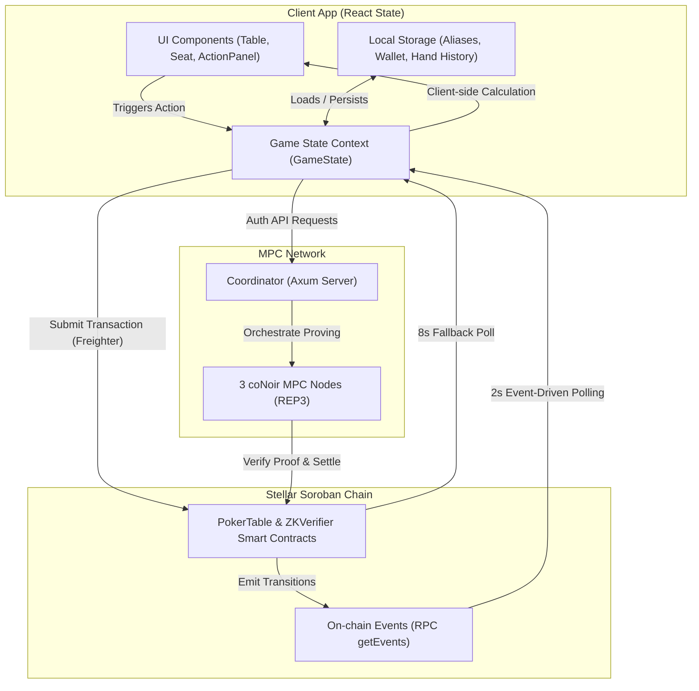

# Frontend State Management Architecture

This document details the state management architecture of the Stellar Poker frontend. It explains how client-side React state, browser-based local storage, the Axum coordinator, and the Soroban blockchain interact to deliver a real-time, private, and resilient on-chain poker game.

---

## 1. State Flow Overview

Stellar Poker utilizes a multi-layered state architecture where the frontend coordinates local client state, cryptographic MPC/coordinator state, and the immutable on-chain state on Stellar.

---

## 2. State Boundaries: React vs. Local Storage vs. On-Chain Data

State is partitioned across three storage domains depending on its requirements for persistence, security, and consensus.

### React State (Ephemeral & Interactive)
The core game engine is managed through React component state (declared primarily in [Table.tsx](file:///c:/Users/DELL/Desktop/StellPoker/app/src/components/Table.tsx) and packaged inside [use-poker-actions.ts](file:///c:/Users/DELL/Desktop/StellPoker/app/src/lib/use-poker-actions.ts)):
* **`game` (`GameState`)**: Represents the active table model including the player list (stacks, bets, folded/all-in flags), board cards, dealer seat index, active turn indicator, and pot totals.
* **`lobby` (`TableLobbyResponse`)**: Tracks the seats reserved in the coordinator lobby prior to game start.
* **`loading` / `activeRequest`**: Orchestrates UI spinner displays and blocks redundant action submission.
* **`error`**: Centralizes operational errors (transaction rejection, coordinator timeouts) for toast alerts.

### Local Storage (Browser Persistence)
Local storage is reserved for personal display preferences and session histories that require persistence but do not affect consensus or game integrity:
* **Player Aliases** (`stellpoker:alias:<address>`): pure local display preferences. Aliases do not undergo network round-trips; they survive across pages and sessions.
* **Hand History** (`stellpoker:hand-history:<tableId>`): logs the last 50 completed hands (pot, community cards, player's own hole cards, winner, and settlement transaction hash). This enables the table's hand history viewer to display historical summaries even after the active state on the smart contract has moved on.
* **Wallet Session** (`stellar_poker_wallet`): stores the connected Freighter address to enable silent reconnections when the page is reloaded.
* **Notification Preferences** (`stellpoker:notification-prefs`): user preferences for sound and visual alerts.

### On-Chain Data (Canonical Source of Truth)
The Soroban ledger represents the final consensus state. The client pulls the parsed on-chain contract state (`getParsedTableState`) to verify:
* Active game phases (`Waiting`, `Preflop`, `Flop`, `Turn`, `River`, `Showdown`, `Settlement`).
* Actual chip stacks, player actions, active pots, and dealer seat allocations.
* Verified cryptographic commitments (deck root and player hand commitments).

### Coordinator / MPC State (Secret Data)
Since cards are secret-shared, private values are never sent directly to the chain or exposed in cleartext. The coordinator handles:
* Shuffling and dealing coordination across the 3 nodes using REP3.
* Encrypted player card delivery (`getPlayerCards` returning raw card indexes and salts).
* Generating and submitting ZK proofs (UltraHonk) on behalf of the nodes.

---

## 3. Optimistic Updates

To mask network latency and cryptographic proof generation delays, Stellar Poker applies distinct optimistic update patterns.

### Solo Mode (vs. AI)
In solo mode, state transitions are **100% optimistic and local**:
* When a player submits a bet, call, or fold, the app calls `computeSoloBet()` in [use-solo-betting.ts](file:///c:/Users/DELL/Desktop/StellPoker/app/src/lib/use-solo-betting.ts).
* The algorithm deterministically calculates the AI's action based on pot pressure and a seed, updates the stacks, chips, and pots locally, and immediately advances the game state.
* The frontend immediately initiates the next phase (e.g., calling the coordinator to trigger a community card reveal) without blocking the user on transaction submission or consensus rounds.

### Multiplayer Mode
In multiplayer mode, optimistic updates prevent UI locking during heavy transactions:
* **API Success Optimism**: When a dealer triggers a phase (e.g., Deal, Flop Reveal, Showdown), the client calls the coordinator API. As soon as the API returns a positive response (containing the transaction hash of the on-chain submission, proof size, and decoded cards), the React state is **instantly updated** with the new cards and phases before the ledger transaction itself has finalized.
* **Transaction In-Flight Blockers**: While a transaction is being processed, the UI sets `loading = true` and records the `activeRequest`. This disables action panels and betting controls, preventing duplicate transaction submissions.

---

## 4. State Reconciliation with Coordinator and Ledger

To ensure the client UI is identical to the canonical blockchain status, the app utilizes dual-channel reconciliation.

### Event-Driven Sync (Primary)
The Soroban contracts emit specific events for every state transition (join table, hand start, action, reveal, settlement).
1. The app subscribes to these events via `subscribePokerTableEvents()` in [events.ts](file:///c:/Users/DELL/Desktop/StellPoker/app/src/lib/events.ts).
2. It polls the Soroban RPC `getEvents` endpoint every **2 seconds** starting from the current ledger sequence.
3. Upon receiving any event from the table contract, the listener triggers an **immediate** `syncOnChainState()`. This provides real-time updates as soon as transactions are sealed on-chain.

### Interval Polling (Fallback)
If the RPC event subscription is unavailable or fails due to network conditions, a fallback `setInterval` polling loop queries `syncOnChainState()` every **8 seconds**.

### Address Reconciliation (Chain-Address to Wallet)
On-chain contract records seat allocations using internal blockchain keys (referred to as `chain_address` or player index). Web users are authenticated via Freighter wallet addresses (`wallet_address`).
* During `syncOnChainState()`, the frontend queries the coordinator's table lobby.
* It dynamically builds a `walletByChain` map, mapping each on-chain seat's `chain_address` to the corresponding user's `wallet_address`.
* This allows the client to resolve and display the correct player seat names and identicons, bridging the gap between chain-level identities and web UI representation.

---

## 5. Error Recovery & Graceful Degradation

Robust try-catch blocks and graceful fallbacks shield the application from crashing on network hiccups or contract errors.

* **Non-Fatal Syncs**: If `syncOnChainState()` fails (e.g., due to RPC rate limiting or temporary network offline), the error is caught silently. The UI continues to function using the last known state, ensuring the user's interface does not freeze or show a blank screen.
* **Delayed Card Hydration**: If card decryption (`hydrateMyCards`) fails during a network transition, the error is swallowed. The hand progresses, and the app automatically re-attempts card hydration during the next sync cycle when connectivity returns.
* **Failed Event Streams**: If the event stream fails to connect, the application falls back automatically to interval polling. The user experiences slightly longer update times (~8 seconds instead of 2 seconds) but gameplay remains fully functional.
* **Centralized User Alerts**: Serious user-initiated actions (like a transaction rejection from Freighter or an invalid bet size) are caught at the point of action in `usePokerActions.ts` and set in `setError()`, displaying clear troubleshooting messages to the player.

---

## 6. Offline Resilience

Although Texas Hold'em is fundamentally a multi-party game, Stellar Poker provides offline resilience mechanisms to preserve user experience:

1. **Fully Standalone Solo Play**: Since the solo game's dealer logic and AI betting decisions are computed locally in [use-solo-betting.ts](file:///c:/Users/DELL/Desktop/StellPoker/app/src/lib/use-solo-betting.ts), a player who loses network connectivity can continue executing solo hands (using locally stored card details if loaded).
2. **Offline Local State**: Important non-consensus data (Aliases, Hand History, sound options) are stored in Local Storage. If the network goes offline, the hand history panel is still fully queryable and past ledger transaction links remain readable.
3. **Freighter Auto-Recovery**: If the user's internet connection drops and returns, the Freighter integration silently recovers. The `trySilentReconnect()` hook runs on initialization to check for active wallet sessions, avoiding repeated "Connect Wallet" prompts.
